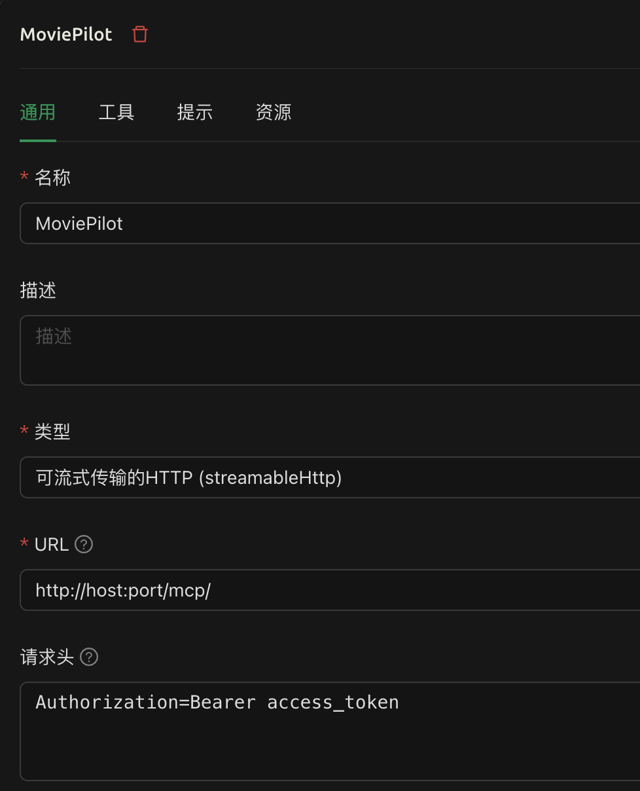

# MCP Server使用手册

## 插件介绍

MCP Server 是一个为 MoviePilot 提供大语言模型服务的插件，它通过启动一个本地服务器，使用户能够通过自然语言与 MoviePilot 进行交互，实现电影资源的搜索、下载、订阅等功能。

## 功能特点

- **自然语言交互**：通过大语言模型理解用户意图，执行相应操作
- **电影资源搜索**：根据电影名称、年份、分辨率等条件搜索资源
- **资源下载**：支持下载找到的电影资源，并在下载前进行确认
- **资源订阅**：支持订阅电影、电视剧资源，自动追踪更新
- **媒体识别**：智能识别用户提供的模糊媒体信息，转换为准确的媒体数据
- **智能建议**：自动检查和纠正电影名称错误

## 安装与配置

1. 在 MoviePilot 插件市场中安装 MCP Server 插件
2. 启用插件后，进入插件配置页面
3. 配置以下参数：
   - **用户名/密码**：用于获取 MoviePilot 的访问令牌
   - **API 密钥（自动生成）**：用于与 MCP Server 通信的密钥

## 使用方法

### 启动服务器

1. 在插件页面中，确保插件已启用
2. 点击"启动服务器"按钮启动 MCP Server
3. 服务器状态会显示在页面上，包括运行状态和端口信息

### 使用工具

MCP Server 提供了多种工具，可以通过大语言模型调用：

#### 媒体识别工具

- **recognize-media**：识别电影/电视剧信息，获取 TMDB ID、豆瓣 ID 等
- **get-media-prompt**：获取媒体识别的处理指南

#### 资源搜索工具

- **search-movie**：搜索电影资源
- **search-tv**：搜索电视剧资源
- **search-anime**：搜索动漫资源

#### 资源下载工具

- **download-resource**：下载指定的资源
- **confirm-download**：确认下载操作

#### 订阅管理工具

- **list-subscribes**：获取所有订阅资源列表
- **add-subscribe**：添加新的订阅
- **delete-subscribe**：删除指定的订阅
- **get-subscribe-detail**：获取订阅详情
- **update-subscribe**：更新订阅信息
- **get-subscribe-by-media**：通过媒体 ID 获取订阅信息


### 客户端配置示例

#### Cherry Studio

目前仅在Cherry Studio上测试过：

##### Streamable HTTP

MCP Server插件中选择服务器类型为`HTTP Streamable`，然后在Cherry Studio中配置如下：



JSON格式配置如下：

```json
 "moviepilot": {
      "url": "https://host:port/mcp/",
      "headers": {
          "Authorization": "Bearer access_token",
          "Content-Type": "application/json"
      }
  }
```

##### Server-Sent Events (SSE)

MCP Server插件中选择服务器类型为`Server-Sent Events (SSE)`，然后在Cherry Studio中配置如下：


JSON格式配置如下：

```json
 "moviepilot_sse": {
      "url": "https://host:port/sse/",
      "headers": {
          "Authorization": "Bearer access_token",
      }
  }
```

其中{host}是Movie Pilot的外网访问域名，{port}是监听端口，可在配置也配置。
{access_token}是MCP Server的认证令牌，可在配置页面获取。

## 使用示例

### 搜索电影资源

```
请帮我搜索电影《星际穿越》，要求4K分辨率
```

### 下载电影资源

```
请下载《流浪地球2》，要求1080P，优先选择国语配音版本
```

### 添加订阅

```
请订阅《权力的游戏》第8季
```

### 查看订阅列表

```
请列出我当前所有的订阅
```

## 推荐的system prompt

```text
电影资源搜索策略
搜索电影资源时：
- 先用search-media工具获取媒体信息，确认正确的mediaid
- 使用search-media-resources工具搜索资源
- 搜索资源时使用的站点依次从优先级高到低选5个站点，站点id通过get-sites获取
- 搜索失败时尝试：模糊搜索、使用不同名称变体、使用原语言名称
- 找到合适资源后停止搜索，避免浪费token

人物作品搜索策略
搜索人物作品时：
- 先用search-media工具（type="person"）确认person_id
- 使用person-credits工具获取作品列表，从第一页开始
- 若用户未指定年份时则依次遍历所有页面，切换页面时询问用户是否继续
- 展示作品信息时：按年份排序、分类展示、包含海报和详情链接
- 如果用户要搜索某个作品的资源，请使用返回的media id调用search-media-resources工具搜索

资源下载策略
- 如未指定保存路径则留空

整体策略
- 如果有图片链接请使用markdown的嵌入HTML的方式展示，如：
- 执行工具前优先从历史消息中查找需要的信息，如没有需要的信息再调用工具
```

## 怎么玩

### 直连

通过支持自定义Header的客户端,如[Cherry Studio](https://github.com/CherryHQ/cherry-studio)，按照上文配置即可连接。

### MCPHub中转

可惜的是目前大部分客户端还不支持自定义Header，所以无法直连到MCP Server。这时我们可以用上一个开源项目[mcphub](https://github.com/samanhappy/mcphub)。它可以聚合多个MCP服务器，提供一个统一的调用接口。

但mcphub仍然不支持自定义Header，所以无法传递认证信息。我们可以通过Nginx来做一层解析，通过在url中传递auth token，在Nginx中提取出来，设置到Header中。配置如下:

```json
server {
    listen 0.0.0.0:3112;  # 端口号与mcp server监听的端口号区别开
    server_name _;        # 通配任意域名访问

    location / {
        access_by_lua_block {
            local token = ngx.var.arg_token
            if token and token ~= "" then
                ngx.req.set_header("Authorization", "Bearer " .. token)
            end
        }

        proxy_pass http://127.0.0.1:3111;  # 后端 MCP Server 地址
        proxy_set_header Host $host;
        proxy_set_header X-Real-IP $remote_addr;
        proxy_set_header X-Forwarded-For $proxy_add_x_forwarded_for;
        proxy_set_header X-Forwarded-Proto $scheme;

        # SSE支持（如果后端有SSE需求）
        proxy_buffering off;
        proxy_cache off;
        proxy_http_version 1.1;
        proxy_set_header Connection "";
        proxy_set_header Accept-Encoding "";
        proxy_read_timeout 3600s;
    }
}
```
将上述内容添加到一个.conf文件放到Nginx的配置目录下，重启Nginx即可。这个配置是将url中的?token=xxx中的xxx解析出来放入到Header中，作为Authorization的参数，这样就不需要在客户端自定义Header了。

接下来安装mcphub，下面是一个compose配置，供参考:
```yml
services:
  mcphub:
    image: samanhappy/mcphub:latest
    container_name: mcphub
    restart: always
    networks:
      - bridge
    ports:
      - "3007:3000"
    volumes:
      - ./mcp_settings.json:/app/mcp_settings.json
    environment:
      - PUID=0
      - PGID=0
networks:
  bridge:
    driver: bridge
```
启动后进入webui添加服务器，服务器类型选择Streamable HTTP（要求MCP Server设置到Streamable HTTP模式，服务器URL填`http://172.17.0.1:3112/mcp/?token=xxxxx`，其中`172.17.0.1`访问到host，根据你自己的情况调整，`3112`是Nginx监听的端口，`xxxxx`是MCP Server的认证令牌，可在配置页面获取。然后点击添加就可以看到刚添加的服务器状态为在线。

服务器添加完成后就可以通过mcphub来调用MCP Server了。比如这里mcphub暴露出来的端口是3007，那么在客户端中配置mcp服务器地址，如果想要Streamable HTTP就填`http://172.17.0.1:3007/mcp`，如果想要SSE就填`http://172.17.0.1:3007/sse`。不建议将mcphub暴露到公网，因为别人只要知道你的域名和端口号就可以直接操作MoviePilot了。可以在局域网部署一些项目用来访问MCP Server，比如我就尝试了下面两种玩法。

#### [lobechat](https://github.com/lobehub/lobe-chat)

安装部署这里就不再赘述了，lobe的MCP入口比较难找，在 助手 -> 插件设置 -> 自定义插件里，选择 Streamable HTTP模式，Streamable HTTP Endpoint URL直接填`http://172.17.0.1:3007/mcp`，然后保存即可。

#### [Astrbot](https://github.com/AstrBotDevs/AstrBot)

项目介绍、安装跳过。部署好之后在MCP设置中添加MCP服务器，配置如下：

```json
{
  "url": "http://172.17.0.1:3007/sse"
}
```
和lobe不同，astrbot仅支持sse。

其它的玩法大家自行摸索哈。有同学可能要问了，为什么不直接在lobe或者astrbot中使用`http://172.17.0.1:3112/mcp/?token=xxxxx`的方式，而非要用mcphub中转一下呢？好问题，我也觉得中间转一次很傻，但是lobe和astrbot直接使用上述链接就是走不通，具体原理我也不太懂了，有同学试出来可以和大家分享一下。

当前的方案只是由于市面上客户端支持度不够的权宜之计，相信很快就会有更多的客户端支持自定义Header，届时就可以直接连到MCP Server了。

## 技术支持

如有任何问题或建议，请通过以下方式联系：

- GitHub Issues: [MoviePilot-Plugins](https://github.com/DzAvril/MoviePilot-Plugins)